# ShipBrain

**An approval-gated AI release pipeline.**

ShipBrain turns engineering tickets into reviewed pull requests, explains failing CI, orchestrates preview and production deployments, manages incidents, and drafts post-mortems — but never acts without a human pressing **Confirm**.

> Built for the Azure AI Foundry Hackathon · June 2026
> Live demo → [ship-brain.vercel.app](https://ship-brain.vercel.app)

---

## The Core Bet

> *"The valuable thing isn't an AI that acts on your behalf — it's an AI that does the boring 80% and hands you a clean decision."*

### Where Engineering Time Goes

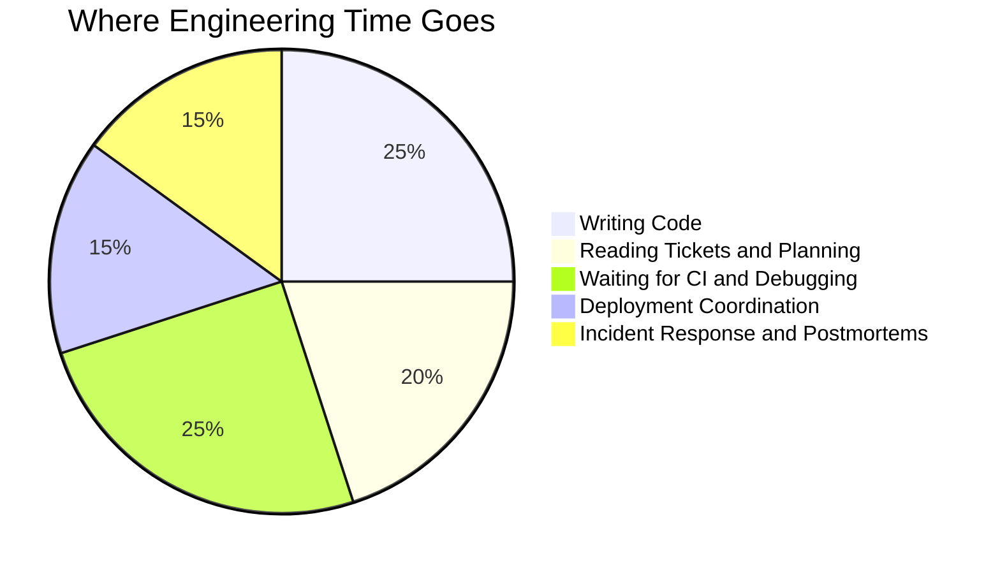
```mermaid
pie title Where Engineering Time Goes
    "Writing Code" : 25
    "Reading Tickets and Planning" : 20
    "Waiting for CI and Debugging" : 25
    "Deployment Coordination" : 15
    "Incident Response and Postmortems" : 15
```

---

## Four Moves, All Gated

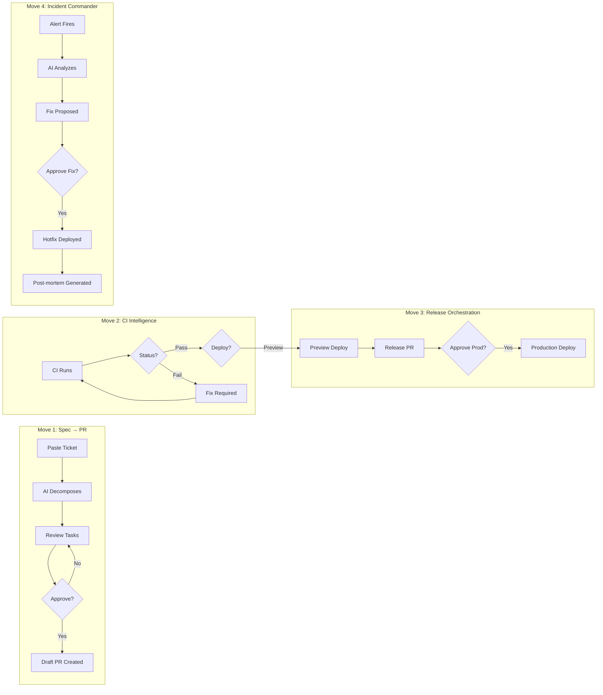
```mermaid
flowchart LR
    subgraph "Move 1: Spec → PR"
        A[Paste Ticket] --> B[AI Decomposes]
        B --> C[Review Tasks]
        C --> D{Approve?}
        D -->|Yes| E[Draft PR Created]
        D -->|No| C
    end

    subgraph "Move 2: CI Intelligence"
        F[CI Runs] --> G{Status?}
        G -->|Pass| J{Deploy?}
        G -->|Fail| H[Fix Required]
        H --> F
    end

    subgraph "Move 3: Release Orchestration"
        J -->|Preview| K[Preview Deploy]
        K --> L[Release PR]
        L --> M{Approve Prod?}
        M -->|Yes| N[Production Deploy]
    end

    subgraph "Move 4: Incident Commander"
        O[Alert Fires] --> P[AI Analyzes]
        P --> Q[Fix Proposed]
        Q --> R{Approve Fix?}
        R -->|Yes| S[Hotfix Deployed]
        S --> T[Post-mortem Generated]
    end
```

---

## System Architecture

### High-Level Architecture

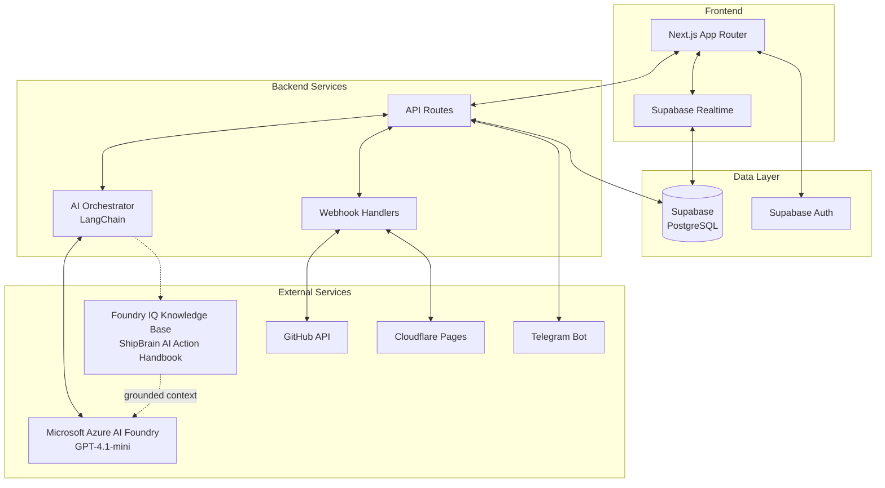
```mermaid
flowchart TB
    subgraph "Frontend"
        UI[Next.js App Router]
        RT[Supabase Realtime]
    end

    subgraph "Backend Services"
        API[API Routes]
        AI[AI Orchestrator<br/>LangChain]
        WH[Webhook Handlers]
    end

    subgraph "External Services"
        GH[GitHub API]
        CF[Cloudflare Pages]
        TG[Telegram Bot]
        LLM[Microsoft Azure AI Foundry<br/>GPT-4.1-mini]
        IQ[Foundry IQ Knowledge Base<br/>ShipBrain AI Action Handbook]
    end

    subgraph "Data Layer"
        SB[(Supabase<br/>PostgreSQL)]
        AUTH[Supabase Auth]
    end

    UI <--> API
    UI <--> RT
    API <--> AI
    API <--> WH
    AI <--> LLM
    AI -.-> IQ
    IQ -. grounded context .-> LLM
    WH <--> GH
    WH <--> CF
    API <--> TG
    API <--> SB
    UI <--> AUTH
    RT <--> SB
```

### Key Directories

```
app/
  (dashboard)/          # All authenticated dashboard pages
  api/                  # API routes (Next.js Route Handlers)
  page.tsx              # Landing page
lib/
  actions/              # Unified write actions (deploy, rollback, hotfix…)
  ai/                   # LLM model, chat, tools, foundry KB, chains
  agent/                # Context builder for AI (live DB snapshot)
  github/               # GitHub API — setup, PRs, workflows, webhooks
  orchestrator/         # Release trace state machine
  telegram/             # Telegram bot commands + NL routing
  cloudflare/           # Cloudflare Pages project management
  shipbrain/            # Semver, API keys, public URL helpers
components/
  app-shell/            # ChatDrawer, sidebar, layout shell
  releases/             # Release Trace Board, RollbackSelector
  landing/              # Landing page sections
supabase/migrations/    # 38 Postgres migrations
scripts/
  reset-sandbox-repo.mjs   # Dev helper: reset sandbox for onboarding test
```

---

## Stack

| Layer | Technology |
|---|---|
| Framework | Next.js 14 (App Router) · TypeScript · React 18 |
| Database | Supabase (Postgres + RLS + Realtime) |
| AI | Azure AI Foundry · GPT-4.1-mini · LangChain |
| Knowledge base | Azure AI Foundry RAG (Foundry IQ — ShipBrain AI Action Handbook) |
| Hosting | Cloudflare Pages (preview + production for connected repos) |
| Auth | Supabase Auth (Email/Password + GitHub OAuth) |
| CI/CD integration | GitHub API + GitHub Actions + Webhooks |
| Mobile surface | Telegram Bot API |
| Incident source | PagerDuty webhook / custom webhook |

---

## Core Pillars

### Pillar 1 — Spec to PR

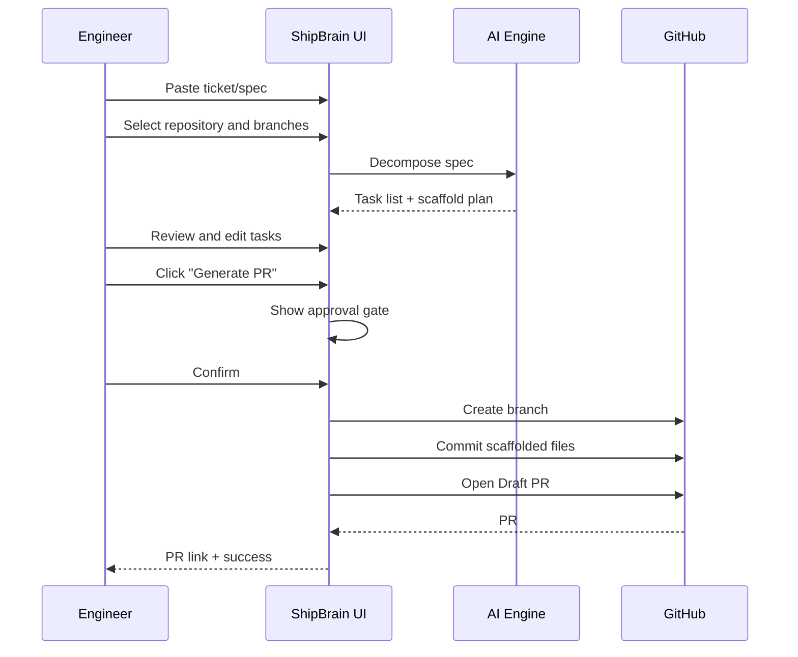
```mermaid
sequenceDiagram
    participant E as Engineer
    participant UI as ShipBrain UI
    participant AI as AI Engine
    participant GH as GitHub

    E->>UI: Paste ticket/spec
    E->>UI: Select repository and branches
    UI->>AI: Decompose spec
    AI-->>UI: Task list + scaffold plan
    E->>UI: Review and edit tasks
    E->>UI: Click "Generate PR"
    UI->>UI: Show approval gate
    E->>UI: Confirm
    UI->>GH: Create branch
    UI->>GH: Commit scaffolded files
    UI->>GH: Open Draft PR
    GH-->>UI: PR #123 created
    UI-->>E: PR link + success
```

### Pillar 2 — CI Monitor & Deployment Queue

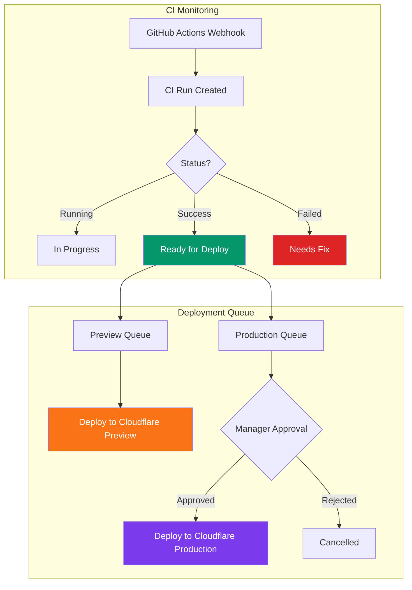
```mermaid
flowchart TB
    subgraph "CI Monitoring"
        A[GitHub Actions Webhook] --> B[CI Run Created]
        B --> C{Status?}
        C -->|Running| D[In Progress]
        C -->|Success| E[Ready for Deploy]
        C -->|Failed| F[Needs Fix]
    end

    subgraph "Deployment Queue"
        E --> G[Preview Queue]
        E --> H[Production Queue]
        G --> I[Deploy to Cloudflare Preview]
        H --> J{Manager Approval}
        J -->|Approved| K[Deploy to Cloudflare Production]
        J -->|Rejected| L[Cancelled]
    end

    style E fill:#059669,color:#fff
    style F fill:#dc2626,color:#fff
    style I fill:#f97316,color:#fff
    style K fill:#7c3aed,color:#fff
```

### Pillar 3 — Release Trace Board

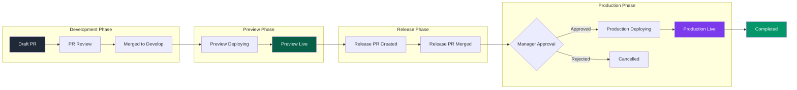
```mermaid
flowchart LR
    subgraph "Development Phase"
        A[Draft PR] --> B[PR Review]
        B --> C[Merged to Develop]
    end

    subgraph "Preview Phase"
        C --> D[Preview Deploying]
        D --> E[Preview Live]
    end

    subgraph "Release Phase"
        E --> F[Release PR Created]
        F --> G[Release PR Merged]
    end

    subgraph "Production Phase"
        G --> H{Manager Approval}
        H -->|Approved| I[Production Deploying]
        I --> J[Production Live]
        H -->|Rejected| K[Cancelled]
    end

    J --> L[Completed]

    style A fill:#1f2937,color:#fff
    style E fill:#065f46,color:#fff
    style J fill:#7c3aed,color:#fff
    style L fill:#059669,color:#fff
```

**Release Trace States:**

| State | Description |
|---|---|
| `draft` | PR created, awaiting review |
| `ready_for_review` | Ready for code review |
| `approved` | Code review approved |
| `merged_develop` | Merged to develop branch |
| `preview_live` | Preview deployment successful |
| `release_pending` | Release PR awaiting merge |
| `merged_main` | Merged to main, ready for prod |
| `production_live` | Production deployment successful |
| `rolling_back` | Rollback in progress |
| `rolled_back` | Rollback completed |
| `completed` | Release fully complete |
| `failed` | Release failed |
| `cancelled` | Release cancelled |

### Pillar 4 — Incident Commander

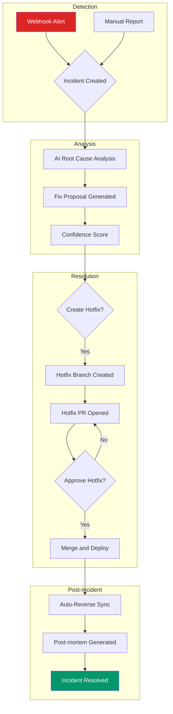
```mermaid
flowchart TB
    subgraph "Detection"
        A[Webhook Alert] --> C{Incident Created}
        B[Manual Report] --> C
    end

    subgraph "Analysis"
        C --> D[AI Root Cause Analysis]
        D --> E[Fix Proposal Generated]
        E --> F[Confidence Score]
    end

    subgraph "Resolution"
        F --> G{Create Hotfix?}
        G -->|Yes| H[Hotfix Branch Created]
        H --> I[Hotfix PR Opened]
        I --> J{Approve Hotfix?}
        J -->|Yes| K[Merge and Deploy]
        J -->|No| I
    end

    subgraph "Post-Incident"
        K --> L[Auto-Reverse Sync]
        L --> M[Post-mortem Generated]
        M --> N[Incident Resolved]
    end

    style A fill:#dc2626,color:#fff
    style N fill:#059669,color:#fff
```

**Post-Mortem Sections (Auto-Generated):**
1. Executive Summary
2. Timeline of Events
3. Root Cause Analysis
4. Impact Assessment
5. Resolution Steps
6. Action Items
7. Lessons Learned

---

## AI Architecture

### Model & Knowledge Base

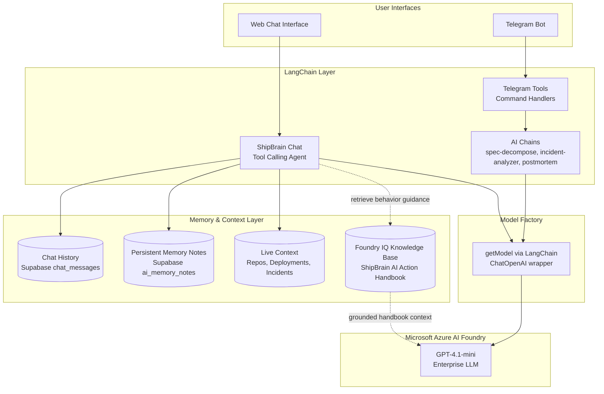
```mermaid
flowchart TB
    subgraph "User Interfaces"
        CHAT[Web Chat Interface]
        TG[Telegram Bot]
    end

    subgraph "Memory & Context Layer"
        HIST[(Chat History<br/>Supabase chat_messages)]
        MEM[(Persistent Memory Notes<br/>Supabase ai_memory_notes)]
        CTX[(Live Context<br/>Repos, Deployments, Incidents)]
        KB[(Foundry IQ Knowledge Base<br/>ShipBrain AI Action Handbook)]
    end

    subgraph "LangChain Layer"
        SC[ShipBrain Chat<br/>Tool Calling Agent]
        TOOLS[Telegram Tools<br/>Command Handlers]
        CHAINS[AI Chains<br/>spec-decompose, incident-analyzer, postmortem]
    end

    subgraph "Model Factory"
        MF[getModel via LangChain<br/>ChatOpenAI wrapper]
    end

    subgraph "Microsoft Azure AI Foundry"
        AF[GPT-4.1-mini<br/>Enterprise LLM]
    end

    CHAT --> SC
    TG --> TOOLS

    SC --> HIST
    SC --> MEM
    SC --> CTX
    SC -. retrieve behavior guidance .-> KB

    SC --> MF
    TOOLS --> CHAINS
    CHAINS --> MF
    KB -. grounded handbook context .-> AF
    MF --> AF
```

### AI Chat Context Flow

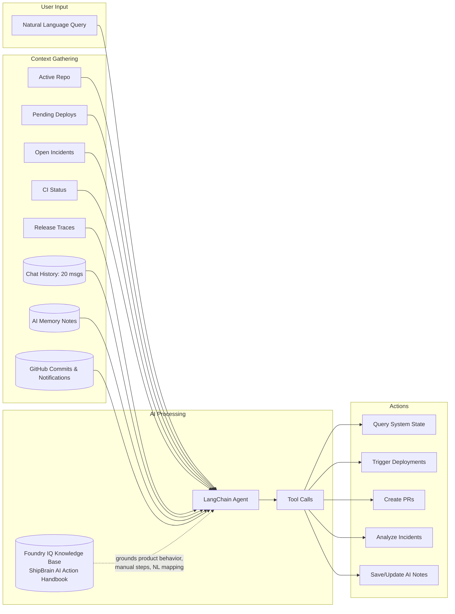
```mermaid
flowchart LR
    subgraph "User Input"
        A[Natural Language Query]
    end

    subgraph "Context Gathering"
        B[Active Repo]
        C[Pending Deploys]
        D[Open Incidents]
        E[CI Status]
        F[Release Traces]
        M1[(Chat History: 20 msgs)]
        M2[(AI Memory Notes)]
        M3[(GitHub Commits & Notifications)]
    end

    subgraph "AI Processing"
        G[LangChain Agent]
        IQ[(Foundry IQ Knowledge Base<br/>ShipBrain AI Action Handbook)]
        H[Tool Calls]
    end

    subgraph "Actions"
        I[Query System State]
        J[Trigger Deployments]
        K[Create PRs]
        L[Analyze Incidents]
        M[Save/Update AI Notes]
    end

    A --> G
    B --> G
    C --> G
    D --> G
    E --> G
    F --> G
    M1 --> G
    M2 --> G
    M3 --> G
    IQ -. grounds product behavior,<br/>manual steps, NL mapping .-> G
    G --> H
    H --> I
    H --> J
    H --> K
    H --> L
    H --> M
```

---

## Deployment Pipeline

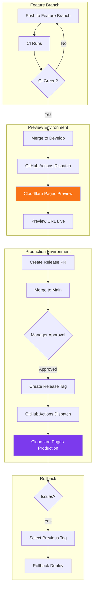
```mermaid
flowchart TB
    subgraph "Feature Branch"
        A[Push to Feature Branch]
        A --> B[CI Runs]
        B --> C{CI Green?}
        C -->|No| A
    end

    subgraph "Preview Environment"
        C -->|Yes| D[Merge to Develop]
        D --> E[GitHub Actions Dispatch]
        E --> F[Cloudflare Pages Preview]
        F --> G[Preview URL Live]
    end

    subgraph "Production Environment"
        G --> H[Create Release PR]
        H --> I[Merge to Main]
        I --> J{Manager Approval}
        J -->|Approved| K[Create Release Tag]
        K --> L[GitHub Actions Dispatch]
        L --> M[Cloudflare Pages Production]
    end

    subgraph "Rollback"
        M --> N{Issues?}
        N -->|Yes| O[Select Previous Tag]
        O --> P[Rollback Deploy]
    end

    style F fill:#f97316,color:#fff
    style M fill:#7c3aed,color:#fff
```

### Rollback System

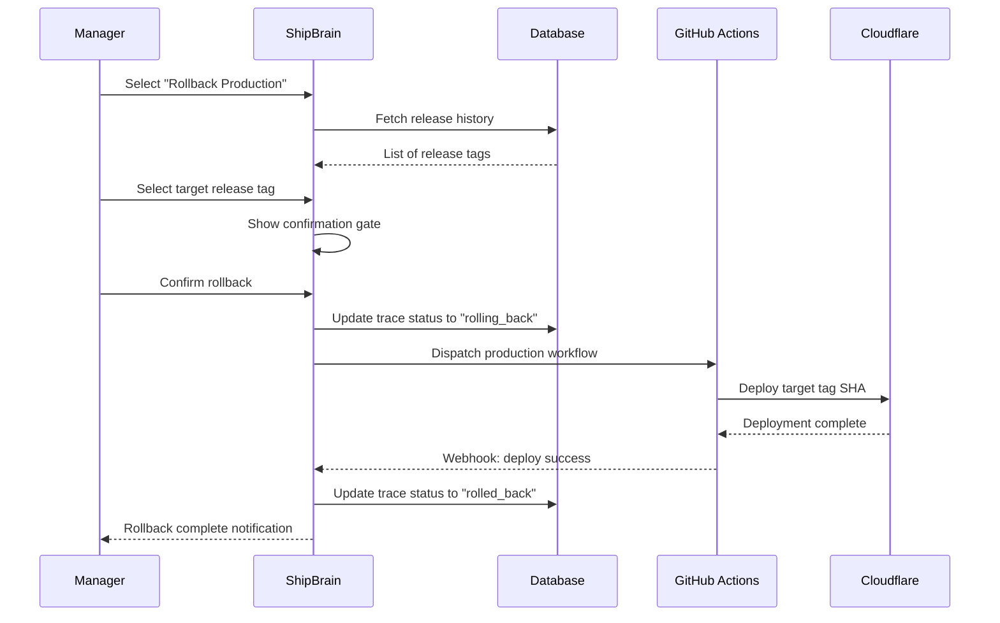
```mermaid
sequenceDiagram
    participant M as Manager
    participant UI as ShipBrain
    participant DB as Database
    participant GH as GitHub Actions
    participant CF as Cloudflare

    M->>UI: Select "Rollback Production"
    UI->>DB: Fetch release history
    DB-->>UI: List of release tags
    M->>UI: Select target release tag
    UI->>UI: Show confirmation gate
    M->>UI: Confirm rollback
    UI->>DB: Update trace status to "rolling_back"
    UI->>GH: Dispatch production workflow
    GH->>CF: Deploy target tag SHA
    CF-->>GH: Deployment complete
    GH-->>UI: Webhook: deploy success
    UI->>DB: Update trace status to "rolled_back"
    UI-->>M: Rollback complete notification
```

---

## Telegram Integration

### Unified Chat & Telegram Architecture

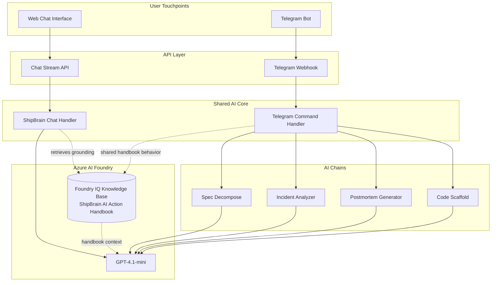
```mermaid
flowchart TB
    subgraph "User Touchpoints"
        WEB[Web Chat Interface]
        TG[Telegram Bot]
    end

    subgraph "API Layer"
        CHAT_API[Chat Stream API]
        TG_WH[Telegram Webhook]
    end

    subgraph "Shared AI Core"
        SBC[ShipBrain Chat Handler]
        TGT[Telegram Command Handler]
    end

    subgraph "AI Chains"
        SD[Spec Decompose]
        IA[Incident Analyzer]
        PM[Postmortem Generator]
        CS[Code Scaffold]
    end

    subgraph "Azure AI Foundry"
        MODEL[GPT-4.1-mini]
        IQ[(Foundry IQ Knowledge Base<br/>ShipBrain AI Action Handbook)]
    end

    WEB --> CHAT_API
    CHAT_API --> SBC
    TG --> TG_WH
    TG_WH --> TGT

    SBC --> MODEL
    SBC -. retrieves grounding .-> IQ
    IQ -. handbook context .-> MODEL
    TGT --> SD
    TGT --> IA
    TGT --> PM
    TGT --> CS
    SD --> MODEL
    IA --> MODEL
    PM --> MODEL
    CS --> MODEL
    TGT -. shared handbook behavior .-> IQ
```

### Telegram Notification Flow

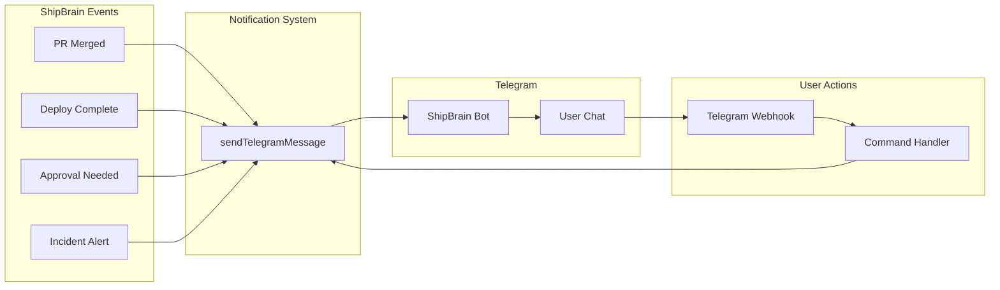
```mermaid
flowchart LR
    subgraph "ShipBrain Events"
        E1[PR Merged]
        E2[Deploy Complete]
        E3[Approval Needed]
        E4[Incident Alert]
    end

    subgraph "Notification System"
        NS[sendTelegramMessage]
    end

    subgraph "Telegram"
        BOT[ShipBrain Bot]
        USER[User Chat]
    end

    subgraph "User Actions"
        WH[Telegram Webhook]
        CMD[Command Handler]
    end

    E1 --> NS
    E2 --> NS
    E3 --> NS
    E4 --> NS
    NS --> BOT --> USER
    USER --> WH --> CMD
    CMD --> NS
```

**Available Commands:**

| Command | Description |
|---|---|
| `/status` | Release trace pending-action summary |
| `/prs` | Pending PRs and release PRs |
| `/traces` | Active release traces |
| `/deployments` | Pending dev/prod deployment queue |
| `/deploy_dev <id>` | Deploy a pending develop preview |
| `/deploy_prod <id> [tag]` | Tag and deploy production release |
| `/rollback <tag>` | Rollback to a previous release |
| `/rollback_releases` | List releases available for rollback |
| `/incidents` | Open incidents |
| `/analyze_incident <id>` | AI root-cause analysis |
| `/create_hotfix <id>` | Create hotfix Draft PR |
| `/approve_fix <id>` | Approve and merge hotfix |
| `/postmortem <id>` | Generate post-mortem |
| `/handbook` | Prepare release handbook for PMs |
| `/draft_pr <spec>` | Create Draft PR from ticket |
| `/release_pr` | Create release PR develop → main |
| `/ci` | Latest CI workflow runs |
| `/help` | Show all available commands |

---

## Webhook Architecture

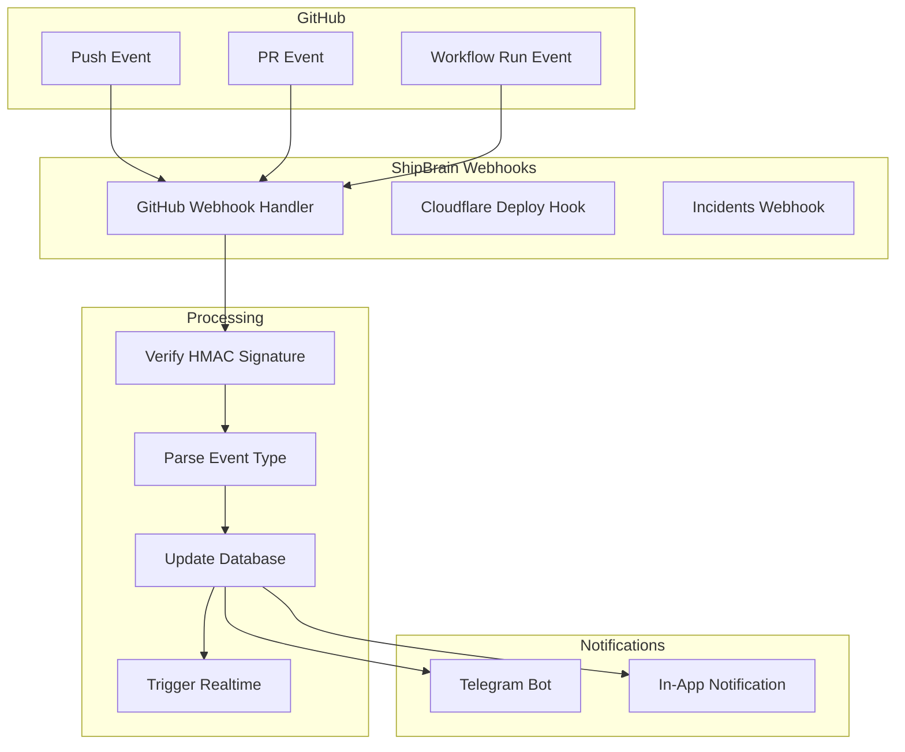
```mermaid
flowchart TB
    subgraph "GitHub"
        GH1[Push Event]
        GH2[PR Event]
        GH3[Workflow Run Event]
    end

    subgraph "ShipBrain Webhooks"
        WH[GitHub Webhook Handler]
        WH2[Cloudflare Deploy Hook]
        WH3[Incidents Webhook]
    end

    subgraph "Processing"
        P1[Verify HMAC Signature]
        P2[Parse Event Type]
        P3[Update Database]
        P4[Trigger Realtime]
    end

    subgraph "Notifications"
        N1[Telegram Bot]
        N2[In-App Notification]
    end

    GH1 --> WH
    GH2 --> WH
    GH3 --> WH
    WH --> P1
    P1 --> P2
    P2 --> P3
    P3 --> P4
    P3 --> N1
    P3 --> N2
```

### Realtime Updates

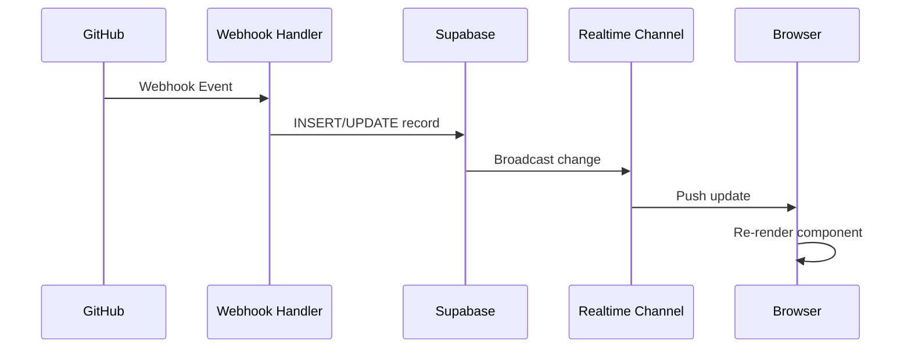
```mermaid
sequenceDiagram
    participant GH as GitHub
    participant WH as Webhook Handler
    participant DB as Supabase
    participant RT as Realtime Channel
    participant UI as Browser

    GH->>WH: Webhook Event
    WH->>DB: INSERT/UPDATE record
    DB->>RT: Broadcast change
    RT->>UI: Push update
    UI->>UI: Re-render component
```

---

## Authentication

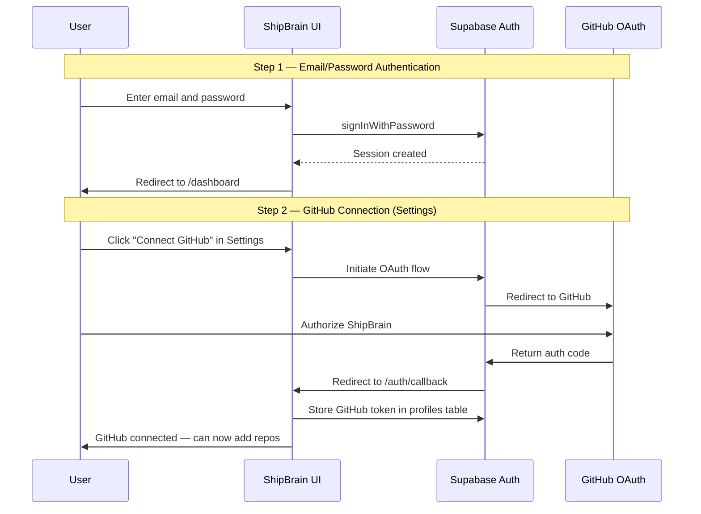
```mermaid
sequenceDiagram
    participant U as User
    participant UI as ShipBrain UI
    participant SB as Supabase Auth
    participant GH as GitHub OAuth

    Note over U,GH: Step 1 — Email/Password Authentication
    U->>UI: Enter email and password
    UI->>SB: signInWithPassword
    SB-->>UI: Session created
    UI->>U: Redirect to /dashboard

    Note over U,GH: Step 2 — GitHub Connection (Settings)
    U->>UI: Click "Connect GitHub" in Settings
    UI->>SB: Initiate OAuth flow
    SB->>GH: Redirect to GitHub
    U->>GH: Authorize ShipBrain
    GH->>SB: Return auth code
    SB->>UI: Redirect to /auth/callback
    UI->>SB: Store GitHub token in profiles table
    UI->>U: GitHub connected — can now add repos
```

**Security:**

| Feature | Implementation |
|---|---|
| Password Auth | Supabase Auth with bcrypt hashing |
| Session Management | Supabase SSR with 7-day rolling refresh |
| GitHub Token Storage | Stored in `profiles.github_access_token` |
| Row-Level Security | All tables protected with RLS policies |
| Webhook Verification | HMAC signature check on all inbound webhooks |
| User Isolation | Each user can only access their own repos/data |

---

## User Flows

### Feature Delivery Journey

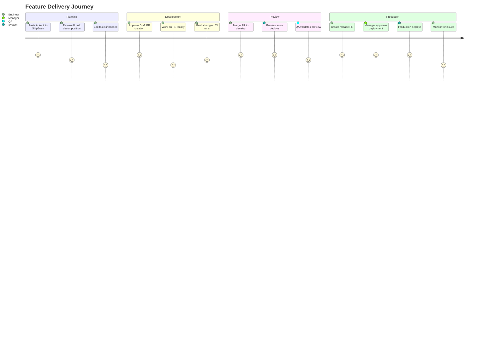
```mermaid
journey
    title Feature Delivery Journey
    section Planning
      Paste ticket into ShipBrain: 5: Engineer
      Review AI task decomposition: 4: Engineer
      Edit tasks if needed: 3: Engineer
    section Development
      Approve Draft PR creation: 5: Engineer
      Work on PR locally: 3: Engineer
      Push changes, CI runs: 4: Engineer
    section Preview
      Merge PR to develop: 5: Engineer
      Preview auto-deploys: 5: System
      QA validates preview: 4: QA
    section Production
      Create release PR: 5: Engineer
      Manager approves deployment: 5: Manager
      Production deploys: 5: System
      Monitor for issues: 3: Engineer
```

### Incident Response Journey

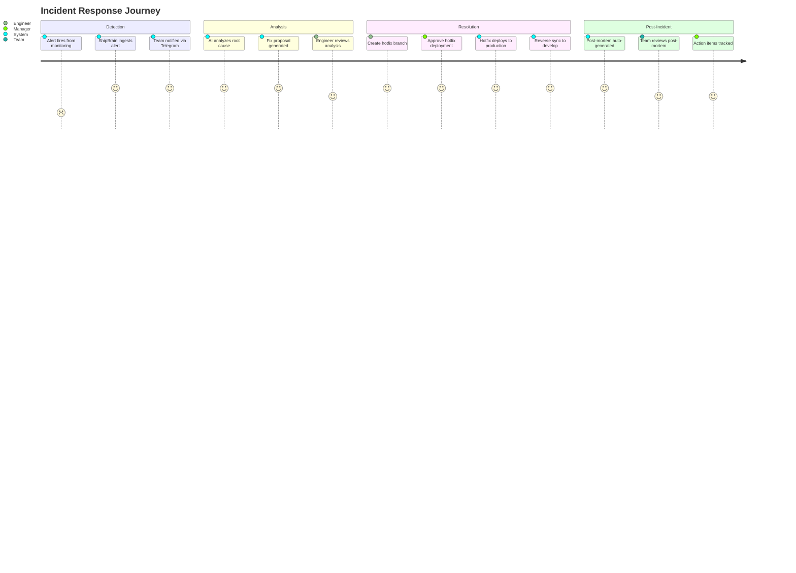
```mermaid
journey
    title Incident Response Journey
    section Detection
      Alert fires from monitoring: 2: System
      ShipBrain ingests alert: 5: System
      Team notified via Telegram: 5: System
    section Analysis
      AI analyzes root cause: 5: System
      Fix proposal generated: 5: System
      Engineer reviews analysis: 4: Engineer
    section Resolution
      Create hotfix branch: 5: Engineer
      Approve hotfix deployment: 5: Manager
      Hotfix deploys to production: 5: System
      Reverse sync to develop: 5: System
    section Post-Incident
      Post-mortem auto-generated: 5: System
      Team reviews post-mortem: 4: Team
      Action items tracked: 4: Manager
```

---

## Database Schema

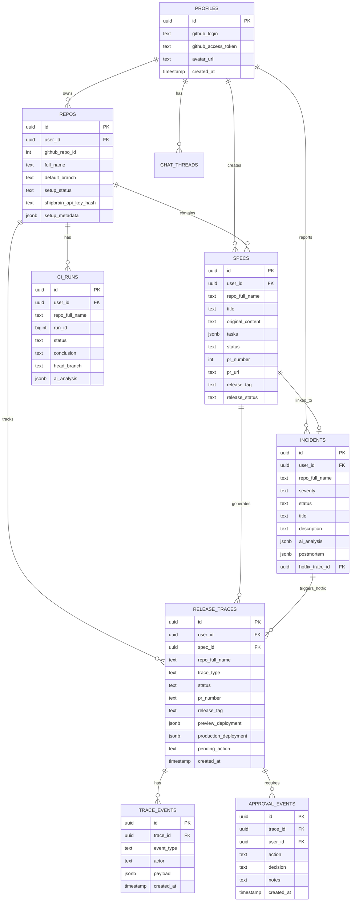
```mermaid
erDiagram
    PROFILES ||--o{ REPOS : owns
    PROFILES ||--o{ SPECS : creates
    PROFILES ||--o{ INCIDENTS : reports
    PROFILES ||--o{ CHAT_THREADS : has

    REPOS ||--o{ SPECS : contains
    REPOS ||--o{ CI_RUNS : has
    REPOS ||--o{ RELEASE_TRACES : tracks

    SPECS ||--o{ RELEASE_TRACES : generates
    SPECS ||--o| INCIDENTS : linked_to

    RELEASE_TRACES ||--o{ TRACE_EVENTS : has
    RELEASE_TRACES ||--o{ APPROVAL_EVENTS : requires

    INCIDENTS ||--o{ RELEASE_TRACES : triggers_hotfix

    PROFILES {
        uuid id PK
        text github_login
        text github_access_token
        text avatar_url
        timestamp created_at
    }

    REPOS {
        uuid id PK
        uuid user_id FK
        int github_repo_id
        text full_name
        text default_branch
        text setup_status
        text shipbrain_api_key_hash
        jsonb setup_metadata
    }

    SPECS {
        uuid id PK
        uuid user_id FK
        text repo_full_name
        text title
        text original_content
        jsonb tasks
        text status
        int pr_number
        text pr_url
        text release_tag
        text release_status
    }

    RELEASE_TRACES {
        uuid id PK
        uuid user_id FK
        uuid spec_id FK
        text repo_full_name
        text trace_type
        text status
        text pr_number
        text release_tag
        jsonb preview_deployment
        jsonb production_deployment
        text pending_action
        timestamp created_at
    }

    TRACE_EVENTS {
        uuid id PK
        uuid trace_id FK
        text event_type
        text actor
        jsonb payload
        timestamp created_at
    }

    INCIDENTS {
        uuid id PK
        uuid user_id FK
        text repo_full_name
        text severity
        text status
        text title
        text description
        jsonb ai_analysis
        jsonb postmortem
        uuid hotfix_trace_id FK
    }

    CI_RUNS {
        uuid id PK
        uuid user_id FK
        text repo_full_name
        bigint run_id
        text status
        text conclusion
        text head_branch
        jsonb ai_analysis
    }

    APPROVAL_EVENTS {
        uuid id PK
        uuid trace_id FK
        uuid user_id FK
        text action
        text decision
        text notes
        timestamp created_at
    }
```

---

## Getting Started

### Prerequisites

- Node.js 18+
- A Supabase project
- A GitHub personal access token (`repo`, `workflow`, `admin:repo_hook` scopes)
- An Azure AI Foundry resource with a `gpt-4.1-mini` deployment
- A Cloudflare account with API token (Pages edit permission)
- Optional: Telegram bot token, PagerDuty token

### 1. Clone and install

```bash
git clone https://github.com/JeevantheDev/ShipBrain.git
cd ShipBrain
npm install
```

### 2. Configure environment

```bash
cp .env.example .env.local
```

Fill in `.env.local` — see the full variable reference below.

### 3. Run database migrations

```bash
npm run migrate:apply
```

### 4. Start the dev server

```bash
npm run dev        # starts on http://localhost:3003
```

### 5. Expose local server for webhooks

GitHub and Telegram webhooks require a public URL. Use [ngrok](https://ngrok.com):

```bash
ngrok http 3003
```

Set the resulting URL as `SHIPBRAIN_API_URL` and `NEXT_PUBLIC_SHIPBRAIN_API_URL` in `.env.local`, then restart the server.

---

## Environment Variables

Copy `.env.example` to `.env.local` and fill in the values.

### AI Provider

| Variable | Description |
|---|---|
| `LLM_PROVIDER` | `microsoft_foundry` \| `anthropic` \| `openai` \| `google` |
| `AZURE_AI_FOUNDRY_API_KEY` | Azure AI Foundry resource API key |
| `AZURE_AI_FOUNDRY_ENDPOINT` | e.g. `https://your-resource.services.ai.azure.com` |
| `AZURE_AI_FOUNDRY_DEPLOYMENT_NAME` | e.g. `gpt-4.1-mini` |
| `AZURE_AI_FOUNDRY_PROJECT_ENDPOINT` | Foundry project endpoint for knowledge base RAG |
| `AZURE_OPENAI_ENDPOINT` | Azure OpenAI endpoint (used as RAG search endpoint) |
| `AZURE_AI_FOUNDRY_KNOWLEDGE_BASE` | Knowledge base name e.g. `shipbrain-knowledgebase740` |
| `ANTHROPIC_API_KEY` | Anthropic API key (fallback) |
| `OPENAI_API_KEY` | OpenAI API key (fallback) |
| `GOOGLE_API_KEY` | Google API key (fallback) |

### Supabase

| Variable | Description |
|---|---|
| `NEXT_PUBLIC_SUPABASE_URL` | Supabase project URL |
| `NEXT_PUBLIC_SUPABASE_ANON_KEY` | Supabase anon/publishable key |
| `SUPABASE_SERVICE_ROLE_KEY` | Service role key — server-side only |
| `DATABASE_URL` | Pooled Postgres connection (pgBouncer) |
| `DIRECT_URL` | Direct Postgres connection (for migrations) |

### GitHub

| Variable | Description |
|---|---|
| `GITHUB_TOKEN` | Personal access token with repo + workflow + webhook scopes |
| `GITHUB_WEBHOOK_SECRET` | Secret for verifying GitHub webhook payloads |
| `GITHUB_USERNAME` | Your GitHub username |

### Application URLs

| Variable | Description |
|---|---|
| `NEXT_PUBLIC_APP_URL` | `http://localhost:3003` in dev, Vercel URL in production |
| `SHIPBRAIN_API_URL` | Public URL for webhook callbacks — use ngrok URL in dev |
| `NEXT_PUBLIC_SHIPBRAIN_API_URL` | Same as above, exposed to the browser |

### Cloudflare Pages

| Variable | Description |
|---|---|
| `CLOUDFLARE_ACCOUNT_ID` | Cloudflare account ID |
| `CLOUDFLARE_API_TOKEN` | API token with Pages edit permission |
| `CLOUDFLARE_WEBHOOK_SECRET` | For verifying Cloudflare deploy result callbacks |

### Telegram (optional)

| Variable | Description |
|---|---|
| `TELEGRAM_BOT_TOKEN` | Token from [@BotFather](https://t.me/BotFather) |
| `TELEGRAM_WEBHOOK_SECRET` | For verifying Telegram webhook payloads |
| `TELEGRAM_FLUSH_SECRET` | For the Telegram message flush endpoint |

### PagerDuty (optional)

| Variable | Description |
|---|---|
| `PAGERDUTY_API_TOKEN` | PagerDuty API token |
| `PAGERDUTY_FROM_EMAIL` | Email used in PagerDuty API requests |
| `PAGERDUTY_API_BASE` | `https://api.eu.pagerduty.com` or `https://api.pagerduty.com` |

---

## API Reference

### Spec-to-PR
| Method | Endpoint | Description |
|---|---|---|
| POST | `/api/ai/spec-to-pr` | Decompose spec and create Draft PR |
| GET | `/api/spec-recipes` | Get PR recipe templates |

### Deployments
| Method | Endpoint | Description |
|---|---|---|
| GET | `/api/deployments/pending` | Get pending deployment queue |
| POST | `/api/deployments/start-preview` | Trigger preview deploy |
| POST | `/api/deployments/start-production` | Trigger production deploy |
| POST | `/api/deployments/rollback` | Rollback to previous tag |

### Release Traces
| Method | Endpoint | Description |
|---|---|---|
| GET | `/api/traces` | Get all release traces |
| PATCH | `/api/traces/[id]` | Update trace status |
| POST | `/api/traces/[id]/action` | Execute trace action |
| GET | `/api/traces/[id]/events` | Get trace event timeline |

### Incidents
| Method | Endpoint | Description |
|---|---|---|
| GET | `/api/incidents` | Get all incidents |
| POST | `/api/incidents` | Create manual incident |
| POST | `/api/incidents/hotfix` | Create or approve hotfix |
| POST | `/api/ai/incident` | AI analysis or post-mortem generation |

### Chat
| Method | Endpoint | Description |
|---|---|---|
| POST | `/api/chat/stream` | Stream AI chat responses (SSE) |
| GET | `/api/chat/threads` | Get chat thread history |

### Webhooks
| Method | Endpoint | Description |
|---|---|---|
| POST | `/api/webhooks/github` | GitHub event receiver |
| POST | `/api/webhooks/incidents` | External incident alert receiver |
| POST | `/api/telegram/webhook` | Telegram bot receiver |

---

## Useful Scripts

```bash
npm run dev              # Start dev server on :3003
npm run build            # Production build
npm run migrate:apply    # Apply Supabase migrations
npm run migrate:status   # Check migration status

make reset-all           # Reset DB + sandbox repo (for onboarding tests)
make reset-sandbox       # Reset sandbox repo only (branches, tags, workflows)
make reset-db            # Reset app data only (keeps auth users)
```

---

## Glossary

| Term | Definition |
|---|---|
| **Spec** | A ticket or requirement document input by the user |
| **Scaffold** | Auto-generated starter code from AI decomposition |
| **Trace** | A release trace tracking a feature from PR to production |
| **Gate** | An approval checkpoint requiring human confirmation |
| **Hotfix** | Emergency fix deployed directly to production |
| **Reverse Sync** | Auto-PR to merge hotfix changes from main back to develop |
| **Release Tag** | Semantic version tag applied to production deployments |
| **Foundry IQ** | Azure AI Foundry knowledge base grounding the AI with the ShipBrain handbook |

---

## Team

**Jeevan Jyoti Dash** · **Amit Kumar Rout**

Built on Azure AI Foundry · GPT-4.1-mini · June 2026

> *AI does the work. You make the call.*
