# ShipBrain
## Product Requirements Document — Final Version

**Version 2.0** · **2026-06-01** · **Hackathon Theme 06 — AI-Powered Production Function**

---

## Table of Contents

1. [Executive Summary](#1-executive-summary)
2. [Problem Statement](#2-problem-statement)
3. [Solution Overview](#3-solution-overview)
4. [System Architecture](#4-system-architecture)
5. [Core Pillars](#5-core-pillars)
6. [Feature Deep Dives](#6-feature-deep-dives)
7. [User Flows](#7-user-flows)
8. [Technical Implementation](#8-technical-implementation)
9. [Integration Points](#9-integration-points)
10. [Database Schema](#10-database-schema)
11. [API Reference](#11-api-reference)
12. [Success Metrics](#12-success-metrics)

---

## 1. Executive Summary

**ShipBrain** is an AI-powered software delivery orchestration platform that transforms how engineering teams ship code. It automates the mechanical work across the entire delivery lifecycle — from ticket decomposition to production deployment — while keeping humans in control through explicit approval gates at every critical transition.

### The Core Bet

> *"The valuable thing isn't an AI that acts on your behalf — it's an AI that does the boring 80% and hands you a clean decision."*

ShipBrain implements a single design pattern used everywhere: **the approval gate**. Same shape, same muscle memory, whether you're shipping a PR, deploying to production, or approving a hotfix.

### Key Differentiators

| Traditional Tools | ShipBrain |
|------------------|-----------|
| AI autocompletes code | AI decomposes entire tickets into PRs |
| Manual CI log reading | AI explains failures in plain English |
| Separate tools for deploy/incidents | Unified release trace timeline |
| No visibility into approval decisions | Full audit trail with approval gates |
| Manual incident post-mortems | Auto-generated post-mortems in 2 minutes |

---

## 2. Problem Statement

### The Engineer's Daily Friction

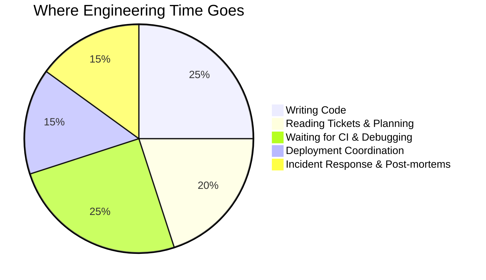

Engineers spend **75% of their time** on mechanical tasks:
- Breaking down tickets into tasks
- Opening PRs with boilerplate
- Decoding cryptic CI failures
- Coordinating deployments across environments
- Writing post-mortems nobody reads

### The Autonomy Paradox

Existing AI tools fall into two camps:

1. **Too Little**: Autocomplete suggestions that save seconds, not hours
2. **Too Much**: Autonomous agents that ship broken code while you sleep

Neither is the right shape for production software where reliability matters.

---

## 3. Solution Overview

### Four Moves, All Gated

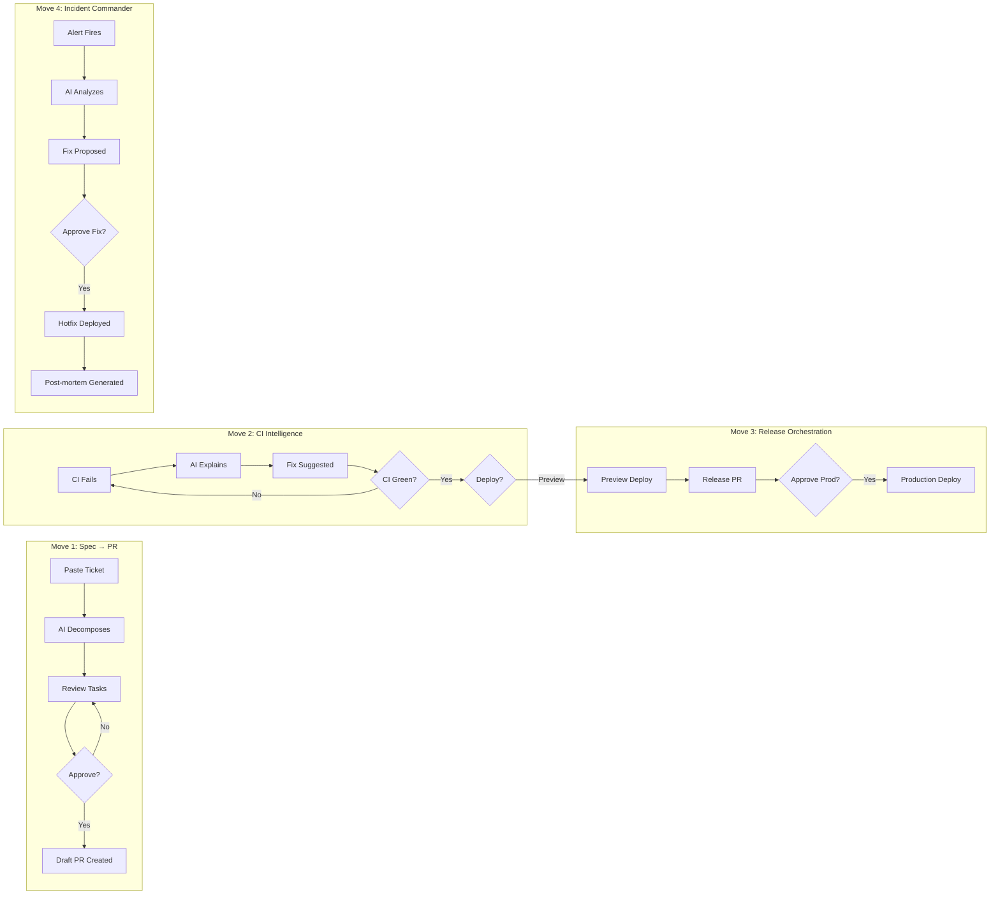

---

## 4. System Architecture

### High-Level Architecture

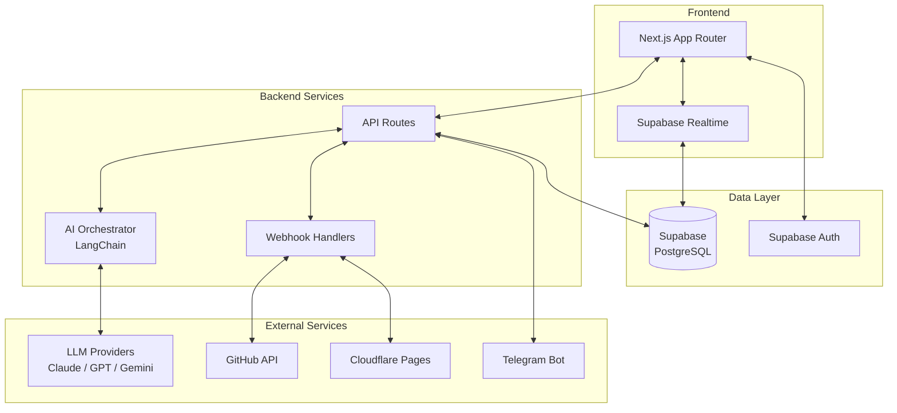

### Tech Stack

| Layer | Technology |
|-------|------------|
| Frontend | Next.js 14 (App Router), React 18, TypeScript |
| Styling | CSS Modules, CSS Variables |
| Backend | Next.js API Routes, Server Actions |
| Database | Supabase (PostgreSQL + Realtime + Auth) |
| **AI (Primary)** | **Microsoft Azure AI Foundry** (GPT-4) via LangChain |
| AI (Fallback) | Google Gemini, Anthropic Claude, OpenAI GPT-4 |
| GitHub | Octokit, GitHub Actions, Webhooks |
| Deployment | Cloudflare Pages (Preview), Vercel (Production) |
| Notifications | Telegram Bot API |

> **Hackathon Theme Compliance:** ShipBrain uses **Microsoft Azure AI Foundry** as its default AI provider, meeting the hackathon requirement for AI-Powered Production Functions.

---

## 5. Core Pillars

### Pillar 1: Spec-to-PR

Transform tickets into production-ready Draft PRs with AI task decomposition.

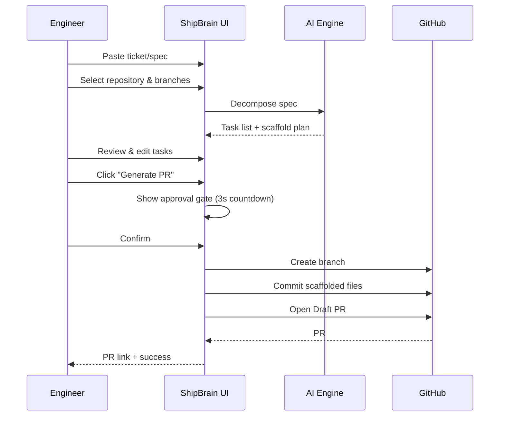

**Features:**
- AI-powered ticket decomposition
- Code scaffold generation
- PR title & reviewer suggestions
- Developer handoff documents
- PR recipe templates (feature, bugfix, hotfix, release)
- Editable task list before commit
- 3-second approval countdown

---

### Pillar 2: CI Intelligence

Real-time CI monitoring with AI-powered failure diagnosis and gated deployments.

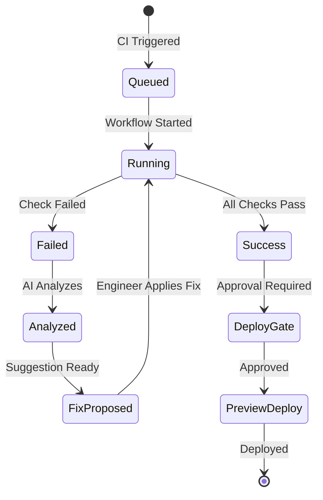

**Features:**
- Real-time workflow status via Supabase Realtime
- Plain-English failure explanations
- Copy-paste fix suggestions
- Deploy button locked until CI green
- Separate preview/production deployment queues
- Environment classification (PROD/DEV/CI)

---

### Pillar 3: Release Trace Board

Unified timeline tracking releases from PR to production with full orchestration.

```mermaid
flowchart LR
    subgraph "Development Phase"
        A[Draft PR] --> B[PR Review]
        B --> C[Merged to Develop]
    end

    subgraph "Preview Phase"
        C --> D[Preview Deploying]
        D --> E[Preview Live]
    end

    subgraph "Release Phase"
        E --> F[Release PR Created]
        F --> G[Release PR Merged]
    end

    subgraph "Production Phase"
        G --> H{Manager Approval}
        H -->|Approved| I[Production Deploying]
        I --> J[Production Live]
        H -->|Rejected| K[Cancelled]
    end

    J --> L[Completed]

    style A fill:#1f2937
    style E fill:#065f46
    style J fill:#7c3aed
    style L fill:#059669
```

**Release Trace States:**

| State | Description |
|-------|-------------|
| `draft` | PR created, awaiting review |
| `ready_for_review` | Ready for code review |
| `approved` | Code review approved |
| `merged_develop` | Merged to develop branch |
| `preview_live` | Preview deployment successful |
| `release_pending` | Release PR awaiting merge |
| `merged_main` | Merged to main, ready for prod |
| `production_live` | Production deployment successful |
| `rolling_back` | Rollback in progress |
| `rolled_back` | Rollback completed |
| `completed` | Release fully complete |
| `failed` | Release failed |
| `cancelled` | Release cancelled |

---

### Pillar 4: Incident Commander

Alert-driven incident management with AI analysis, hotfix orchestration, and auto-generated post-mortems.

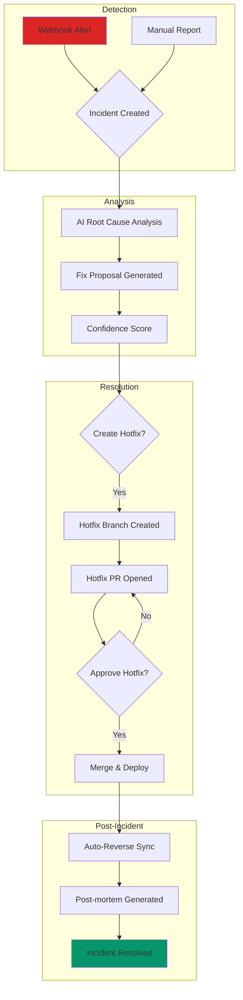

**Post-Mortem Sections (Auto-Generated):**
1. Executive Summary
2. Timeline of Events
3. Root Cause Analysis
4. Impact Assessment
5. Resolution Steps
6. Action Items
7. Lessons Learned

---

## 6. Feature Deep Dives

### 6.1 AI Chat Interface

Context-aware AI assistant with access to system state.

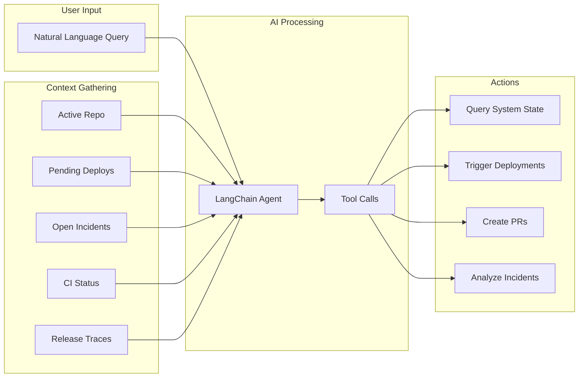

**Quick Prompts:**
- "What's pending deployment?"
- "Show my recent PRs"
- "Deploy to preview"
- "Create hotfix for active incident"
- "Rollback production"

---

### 6.2 Deployment Pipeline

Dual-environment deployment with approval gates.

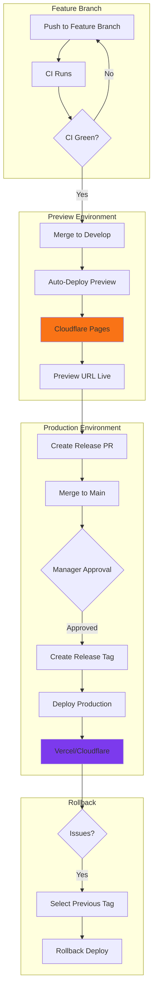

---

### 6.3 Unified Chat & Telegram Architecture

Both the Web Chat interface and Telegram Bot share the same AI backend, providing a consistent experience across platforms.

```mermaid
flowchart TB
    subgraph "User Touchpoints"
        WEB[Web Chat Interface<br/>/chat page]
        TG[Telegram Bot<br/>@ShipBrainBot]
    end

    subgraph "API Layer"
        CHAT_API[/api/chat/stream]
        TG_WH[/api/telegram/webhook]
    end

    subgraph "Shared AI Core"
        SBC[answerShipBrainQuestion<br/>shipbrain-chat.ts]
        TGT[runTelegramCommand<br/>telegram/tools.ts]
    end

    subgraph "AI Chains"
        SD[Spec Decompose]
        IA[Incident Analyzer]
        PM[Postmortem Generator]
        CS[Code Scaffold]
    end

    subgraph "Azure AI Foundry"
        MODEL[getModel<br/>GPT-4 via Foundry]
    end

    WEB --> CHAT_API --> SBC
    TG --> TG_WH --> TGT

    SBC --> MODEL
    TGT --> SD & IA & PM & CS
    SD & IA & PM & CS --> MODEL
```

**Why Unified Architecture?**
- Same AI model powers both interfaces
- Consistent responses across web and mobile
- Single source of truth for all AI capabilities
- Easier maintenance and updates

---

### 6.4 Telegram Bot Commands

Real-time notifications and approvals via Telegram.

**Available Commands:**

| Command | Description |
|---------|-------------|
| `/status` | Show current deployment status |
| `/pending` | List pending approvals |
| `/traces` | Show release traces |
| `/incidents` | List active incidents |
| `/plan <spec>` | Create AI development plan |
| `/draft_pr <spec>` | Create Draft PR from spec |
| `/analyze_incident <id>` | AI analyze incident |
| `/create_hotfix <id>` | Create hotfix for incident |
| `/approve_fix <id>` | Approve hotfix deployment |
| `/postmortem <id>` | Generate post-mortem |
| `/rollback <tag>` | Initiate production rollback |
| `/approve <trace_id>` | Approve pending deployment |

**Notification Types:**
- PR merged to develop
- Preview deployment complete
- Release PR ready for review
- Production deployment pending approval
- Incident detected
- Hotfix ready for approval

---

### 6.4 Rollback System

Quick revert to previous production releases.

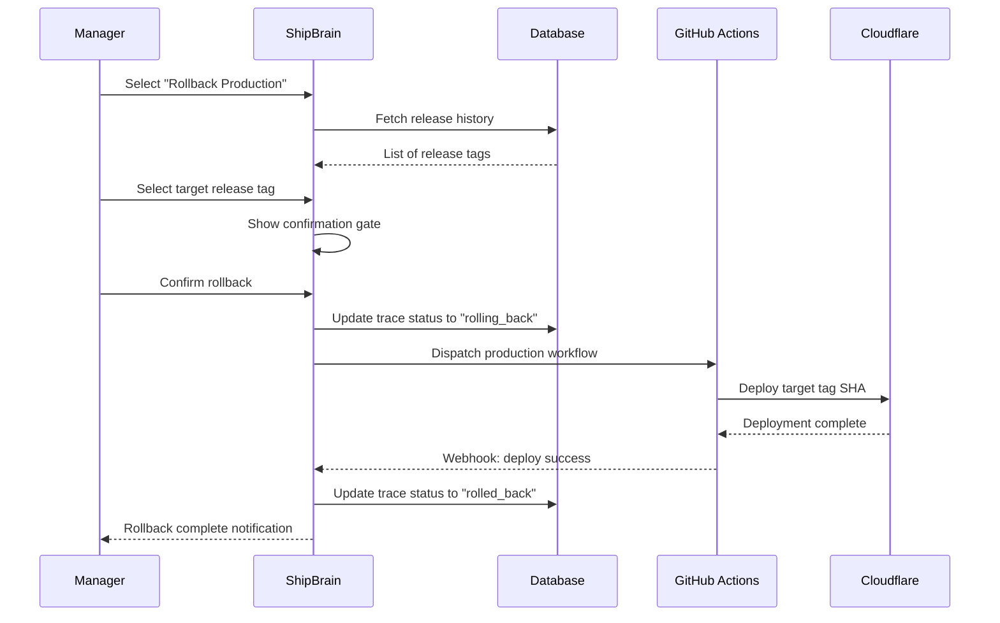

---

## 7. User Flows

### 7.1 End-to-End Feature Delivery

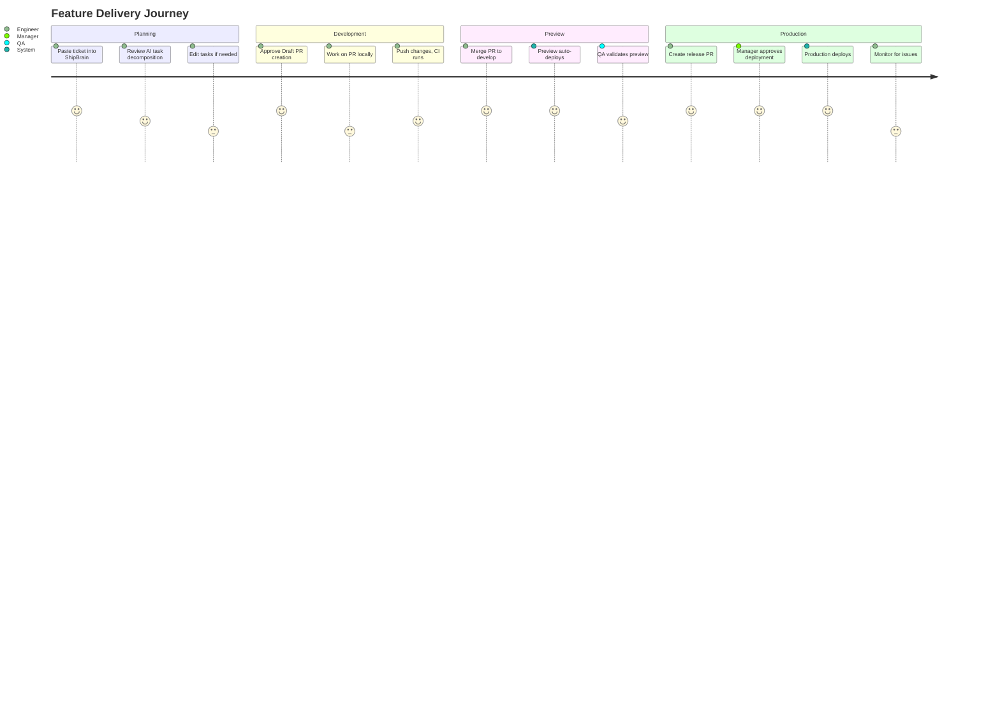

### 7.2 Incident Response Flow

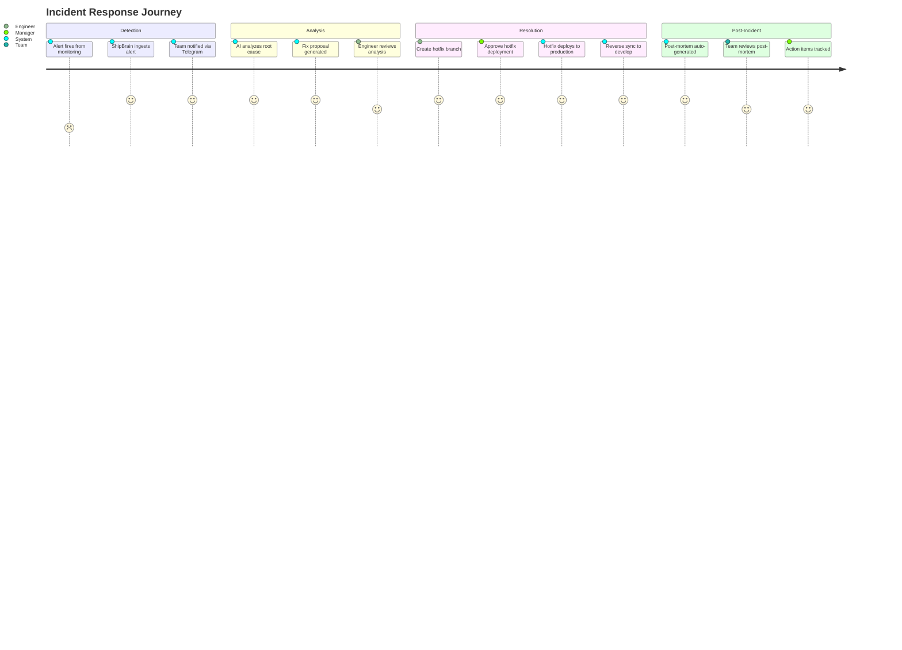

---

## 8. Technical Implementation

### 8.1 AI Model Architecture

ShipBrain uses **Microsoft Azure AI Foundry** as the default LLM provider, with fallback support for other providers.

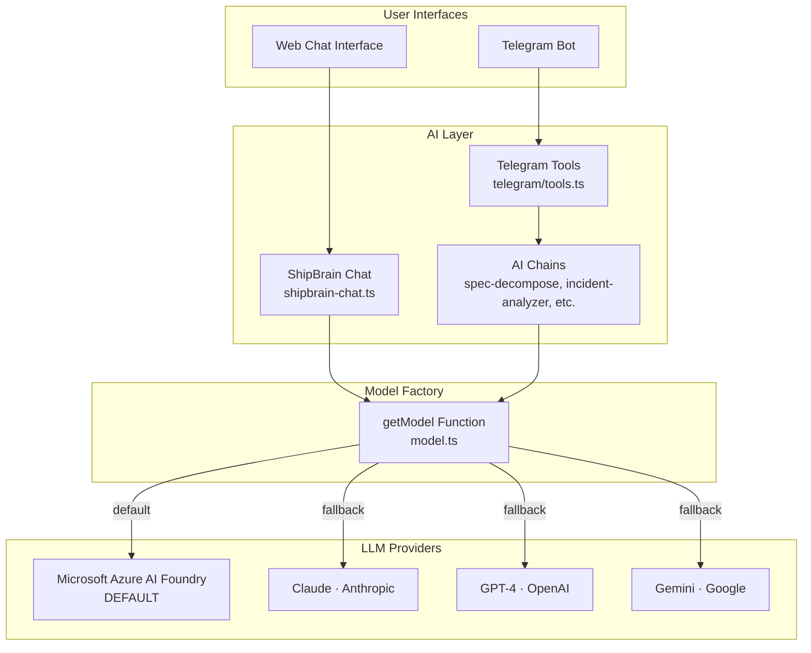

**Unified AI Backend:**
- Both **Web Chat** and **Telegram Bot** use the same `getModel()` function
- All AI chains (spec decomposition, incident analysis, postmortem generation) share the same model
- Seamless experience across web and mobile (Telegram)

**Provider Priority:**
1. **Microsoft Azure AI Foundry** (default) - Enterprise-grade, hackathon theme requirement
2. **Google Gemini** - First fallback if Foundry not configured
3. **Anthropic Claude** - Second fallback
4. **OpenAI GPT-4** - Third fallback

**Environment Variables:**
```bash
# Microsoft Azure AI Foundry (DEFAULT - Hackathon Theme)
LLM_PROVIDER=microsoft_foundry
AZURE_AI_FOUNDRY_ENDPOINT=https://your-resource.services.ai.azure.com
AZURE_AI_FOUNDRY_API_KEY=...
AZURE_AI_FOUNDRY_DEPLOYMENT_NAME=gpt-4o

# Alternative: Claude
LLM_PROVIDER=anthropic
ANTHROPIC_API_KEY=sk-ant-...

# Alternative: OpenAI
LLM_PROVIDER=openai
OPENAI_API_KEY=sk-...

# Alternative: Google Gemini
LLM_PROVIDER=google
GOOGLE_API_KEY=...
```

---

### 8.2 Webhook Architecture

```mermaid
flowchart TB
    subgraph "GitHub"
        GH1[Push Event]
        GH2[PR Event]
        GH3[Workflow Run Event]
    end

    subgraph "ShipBrain Webhooks"
        WH[/api/webhooks/github]
        WH2[/api/webhooks/cloudflare/deploy]
        WH3[/api/webhooks/incidents]
    end

    subgraph "Processing"
        P1[Verify HMAC Signature]
        P2[Parse Event Type]
        P3[Update Database]
        P4[Trigger Realtime]
    end

    subgraph "Notifications"
        N1[Telegram Bot]
        N2[In-App Notification]
    end

    GH1 & GH2 & GH3 --> WH
    WH --> P1 --> P2 --> P3 --> P4
    P3 --> N1 & N2
```

---

### 8.3 Realtime Updates

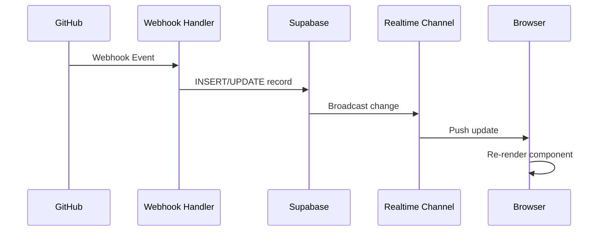

---

## 9. Integration Points

### 9.1 GitHub Integration

| Integration | Purpose |
|-------------|---------|
| OAuth | User authentication |
| Repos API | List and select repositories |
| Contents API | Create files, read structure |
| Pull Requests API | Create Draft PRs, merge |
| Actions API | Dispatch workflows, read status |
| Webhooks | Real-time event ingestion |

### 9.2 Cloudflare Integration

| Integration | Purpose |
|-------------|---------|
| Pages API | Manage preview deployments |
| Deploy Hooks | Trigger deployments |
| Deploy Webhooks | Receive deployment status |

### 9.3 Telegram Integration

| Integration | Purpose |
|-------------|---------|
| Bot API | Send notifications |
| Inline Keyboards | Approval buttons |
| Commands | Status queries |
| Webhooks | Receive user responses |

---

## 10. Database Schema

### Entity Relationship Diagram

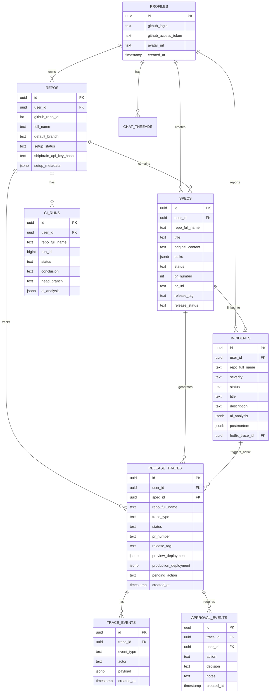

---

## 11. API Reference

### Core Endpoints

#### Spec-to-PR
| Method | Endpoint | Description |
|--------|----------|-------------|
| POST | `/api/ai/spec-to-pr` | Decompose spec and/or create PR |
| GET | `/api/spec-recipes` | Get PR recipe templates |
| POST | `/api/spec-runs` | Save PR run history |

#### Deployments
| Method | Endpoint | Description |
|--------|----------|-------------|
| GET | `/api/deployments/pending` | Get pending deployment queue |
| POST | `/api/deployments/start-preview` | Trigger preview deploy |
| POST | `/api/deployments/start-production` | Trigger production deploy |
| POST | `/api/deployments/approval` | Record approval decision |
| POST | `/api/deployments/rollback` | Rollback to previous tag |

#### Release Traces
| Method | Endpoint | Description |
|--------|----------|-------------|
| GET | `/api/traces` | Get all release traces |
| PATCH | `/api/traces/[id]` | Update trace status |
| POST | `/api/traces/[id]/action` | Execute trace action |
| GET | `/api/traces/[id]/events` | Get trace event timeline |

#### Incidents
| Method | Endpoint | Description |
|--------|----------|-------------|
| GET | `/api/incidents` | Get all incidents |
| POST | `/api/incidents` | Create manual incident |
| POST | `/api/incidents/hotfix` | Create/approve hotfix |
| POST | `/api/ai/incident` | Analyze incident or generate post-mortem |

#### Chat
| Method | Endpoint | Description |
|--------|----------|-------------|
| POST | `/api/chat/stream` | Stream chat responses |
| GET | `/api/chat/threads` | Get chat thread history |
| GET | `/api/agent/context` | Get context for AI agent |

---

## 12. Success Metrics

### Primary Metrics

| Metric | Target | Measurement |
|--------|--------|-------------|
| Spec → Draft PR time | < 3 minutes | Time from paste to PR link |
| CI failure explanation quality | > 90% actionable | User feedback rating |
| Incident → post-mortem draft | < 2 minutes | Time from resolution to draft |
| Deployment approval latency | < 5 minutes | Time from ready to approved |
| Rollback execution time | < 2 minutes | Time from trigger to live |

### Hackathon Demo Metrics

| Metric | Target |
|--------|--------|
| End-to-end spec → production | Complete in live demo |
| Model switching | Claude → GPT-4 → Gemini with .env only |
| Incident simulation | Alert → analysis → hotfix → post-mortem |
| Approval gate UX | Zero confusion for judges |
| Telegram notifications | Real-time during demo |

---

## Appendix A: User Interface Screenshots

### Dashboard
- Command center with quick actions
- Pending deployment queue
- Environment status cards
- Recent activity feed

### Spec-to-PR
- Monaco editor for spec input
- Task decomposition panel
- Scaffold preview
- Approval gate modal

### Release Trace Board
- Kanban-style phase columns
- Trace cards with status pills
- Event timeline drawer
- Action buttons per phase

### Incident Commander
- Incident feed with severity badges
- AI analysis panel
- Hotfix creation modal
- Post-mortem preview

### Chat Interface
- Quick prompt chips
- Message thread
- Action confirmation bars
- Option selection panels

---

## Appendix B: Glossary

| Term | Definition |
|------|------------|
| **Spec** | A ticket or requirement document input by the user |
| **Scaffold** | Auto-generated starter code from AI decomposition |
| **Trace** | A release trace tracking a feature from PR to production |
| **Gate** | An approval checkpoint requiring human confirmation |
| **Hotfix** | Emergency fix deployed directly to production |
| **Reverse Sync** | Auto-PR to merge hotfix changes from main back to develop |
| **Release Tag** | Semantic version tag applied to production deployments |

---

## Appendix C: Environment Variables

```bash
# Database (Supabase)
NEXT_PUBLIC_SUPABASE_URL=https://xxx.supabase.co
NEXT_PUBLIC_SUPABASE_ANON_KEY=eyJ...
SUPABASE_SERVICE_ROLE_KEY=eyJ...

# AI Provider - Microsoft Azure AI Foundry (DEFAULT)
LLM_PROVIDER=microsoft_foundry
AZURE_AI_FOUNDRY_ENDPOINT=https://your-resource.services.ai.azure.com
AZURE_AI_FOUNDRY_API_KEY=...
AZURE_AI_FOUNDRY_DEPLOYMENT_NAME=gpt-4o

# Fallback AI Providers (optional)
GOOGLE_API_KEY=...
ANTHROPIC_API_KEY=sk-ant-...
OPENAI_API_KEY=sk-...

# GitHub Integration
GITHUB_APP_ID=...
GITHUB_PRIVATE_KEY=...
GITHUB_WEBHOOK_SECRET=...

# Cloudflare Pages Deployment
CLOUDFLARE_API_TOKEN=...
CLOUDFLARE_ACCOUNT_ID=...

# Telegram Bot Notifications
TELEGRAM_BOT_TOKEN=...
TELEGRAM_CHAT_ID=...

# Application
NEXT_PUBLIC_APP_URL=https://shipbrain.pages.dev
SHIPBRAIN_API_KEY=...
```

---

*Built with too much coffee and a healthy fear of autonomy.*

**ShipBrain** — Ship software at AI speed, with humans still in charge.
